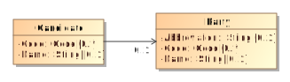
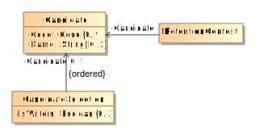

# SchematronMD

This repository contains a [Velocity](https://velocity.apache.org/) template to be used with the MagicDraw Report Wizard to generate a [Schematron](http://schematron.com/) ruleset.

<!-- TOC -->

- [SchematronMD](#schematronmd)
    - [The ruleset](#the-ruleset)
    - [Rule patterns](#rule-patterns)
        - [Forward Lookups](#forward-lookups)
            - [Example](#example)
        - [Reverse Lookups](#reverse-lookups)
            - [Example](#example-1)

<!-- /TOC -->

## The ruleset

The rules generated by the VTL template protect against a class of syntactic errors relating to the use of the `xsd:ID`, `xsd:IDREF` and `xsd:IDREFS` data types.

The `xsd:ID` class of types are used in the [Cast Vote Records](https://github.com/usnistgov/CastVoteRecords) and [Election Results Reporting](https://github.com/usnistgov/ElectionResultsReporting) common data formats to conserve storage space. For example, it would be inefficient to repeat details about the a particular contest in an instance containing multiple CVRs.

Instead, reusable data is defined once and referenced when needed. However, a problem arises when the UML Model is converted to a concrete format such as XML Schema. The `xsd:ID` type is opaque, meaning it doesn't convey any details about the type it refers. Thus, the XML Schema cannot enforce the proper "wiring" of `xsd:ID` to and from `xsd:IDREF` and `xsd:IDREFS`.

Schematron rulesets are used to fill this gap. The VTL template automatically generates rules enforcing the types that can appear on either end of a directed association.

## Rule patterns

There are two patterns of rules generated by the VTL template, **forward lookups**, and **reverse lookups**.

### Forward Lookups

A forward lookup enforces the predicate of the form `{X}Ids must point to an element of type {X}`, where `{X}` is a type in the XML Schema.

#### Example



Consider the type `Candidate`. It has an element `PartyId` to associate a candidate to one or more political parties. A schematron rule enforcing this relationship is given below:

```xml
<sch:rule context="element(*, err:Candidate)">
    <sch:assert test="not(id(err:PartyId)[not(. instance of element(*, err:Party))])">PartyId (<xsl:value-of select="err:PartyId" />) must point to an element of type Party</sch:assert>
</sch:rule>
```

`id(err:PartyId)` uses the XPath `id` function to return the element containing that `id`. It should be a type of `Party`! The predicate in the brackets, `. instance of element(*, err:Party)` checks exactly that.

> The use of `not` in the above example at first glance appears confusing. For the rule to validate, it must not return any elements (an empty sequence casts to the boolean value of `false`). Thus we also negate the predicate, that it only returns an element when the instance is not of the desired type. Because we could potentially list multiple `xsd:ID` in an `XSD:IDREFS`, we cannot test the positive case without knowing the exact number expected, which cannot be done at compile time.

### Reverse Lookups

Reverse lookups are used to validate that reusable data is referenced by other parts of the NIST 1500-XXX CDF instance. For example, it likely does not make sense to define a `Candidate` that is not used by any `Contest`, or a `Party` that is not used by any `Candidate`.

> It is a judgement call if a particular set of reusable data needs to be referenced within the file. For example, a jurisdiction may want to include a `Candidate` that withdrew from an election. Because the `Candidate` might no longer referenced by a `Contest`, it would generate an error.

A reverse lookup enforces a predicate of the form `{X} must have reference from {Y}`, where `{X}` and `{Y}` are types in the XML Schema.

#### Example

Consider the following UML model and schematron rule:



```xml
<sch:rule context="element(*, cdf:Candidate)">
    <sch:assert test="count(idref(current()/@ObjectId)[(local-name() = 'CandidateIds' and .. instance of element(*, cdf:CandidateSelection)) or (local-name() = 'CandidateId' and .. instance of element(*, cdf:RetentionContest))]) > 0">Candidate (<xsl:value-of select="current()/@ObjectId"/>) must have reference from CandidateSelection, RetentionContest</sch:assert>
</sch:rule>
```

The XPath function `idref` finds all the references to `Candidate`. We then apply a predicate that checks if the referencing type is one that is allowed, and if so, adds it to the count. In the above case, `CandidateSelection` and `RetentionContest` are able to reference `Candidate`.  The rule passes as long as at least one type references `Candidate`.